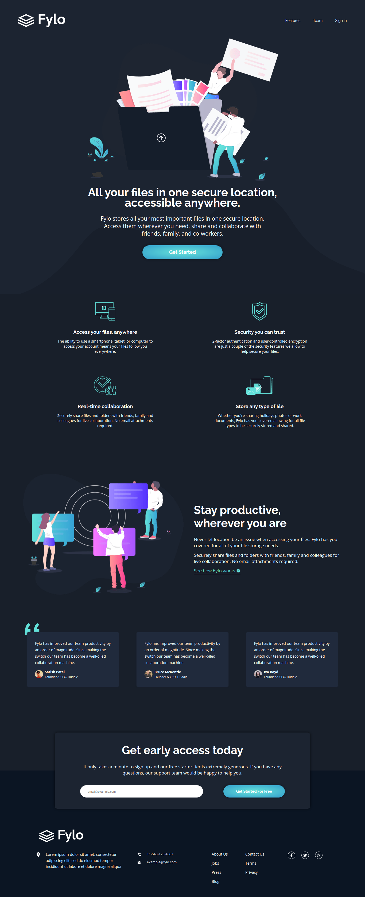

# Frontend Mentor - Fylo dark theme landing page solution

This is a solution to the [Fylo dark theme landing page challenge on Frontend Mentor](https://www.frontendmentor.io/challenges/fylo-dark-theme-landing-page-5ca5f2d21e82137ec91a50fd). Frontend Mentor challenges help you improve your coding skills by building realistic projects. 

## Table of contents

- [Overview](#overview)
  - [The challenge](#the-challenge)
  - [Screenshot](#screenshot)
  - [Links](#links)
- [My process](#my-process)
  - [Built with](#built-with)
  - [What I learned](#what-i-learned)
  - [Continued development](#continued-development)
  - [Useful resources](#useful-resources)
- [Author](#author)

## Overview

### The challenge

Users should be able to:

- View the optimal layout for the site depending on their device's screen size
- See hover states for all interactive elements on the page

### Screenshot

### Links

- [Solution URL](a)
- [Live Site URL](https://luizhf42.github.io/fylo-dark-theme-landing-page-master)

## My process

### Built with

- Semantic HTML5 markup
- CSS3
- Flexbox
- CSS Grid
- Mobile-first workflow
- JavaScript

### What I learned

I made a first try with the mobile-first workflow in this project. Furthermore, all the other technologies and features were used before, so nothing new for me.

### Continued development

I appreciated using the mobile-first workflow, so I will keep focusing on using it. Also, CSS Grid has helped me a lot and I will deepen in this too.

### Useful resources

- [Amazing codepen](https://codepen.io/sosuke/pen/Pjoqqp) - This helped me in making the filter properties to change the icons color.
- [W3Resource](https://www.w3resource.com/javascript/form/email-validation.php) - Get the email regex here. 

## Author

- Frontend Mentor - [@luizhf42](https://www.frontendmentor.io/profile/luizhf42)
